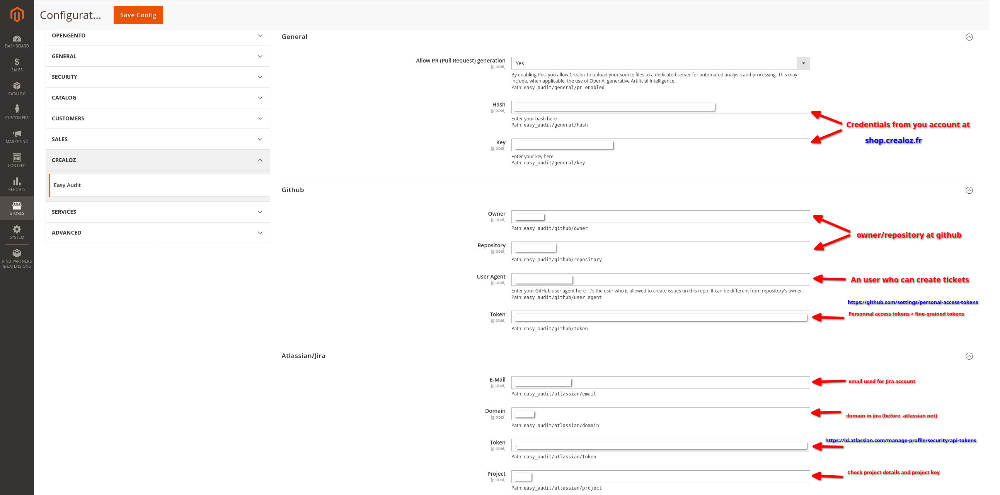
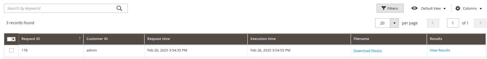
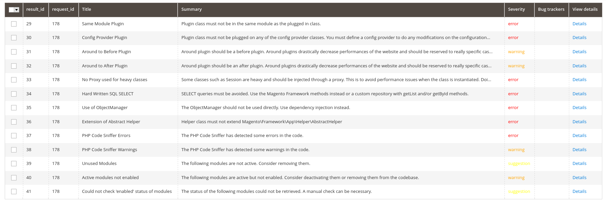
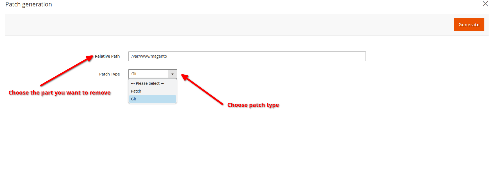
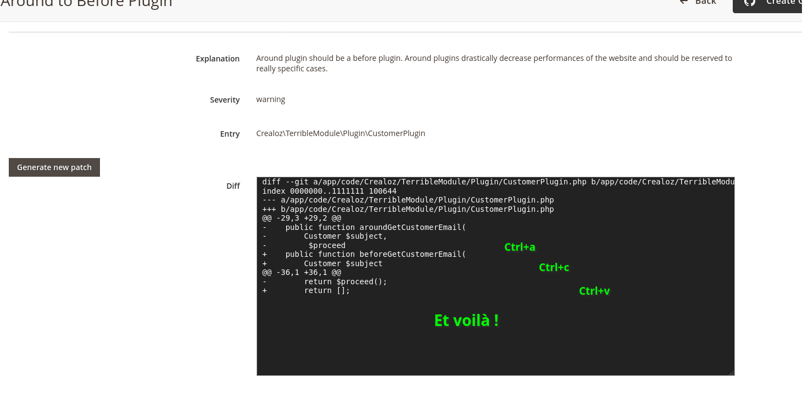
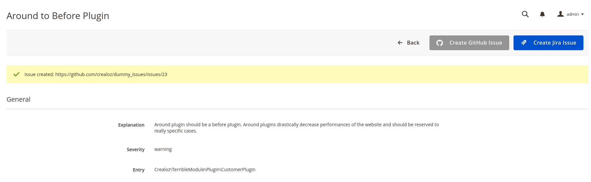
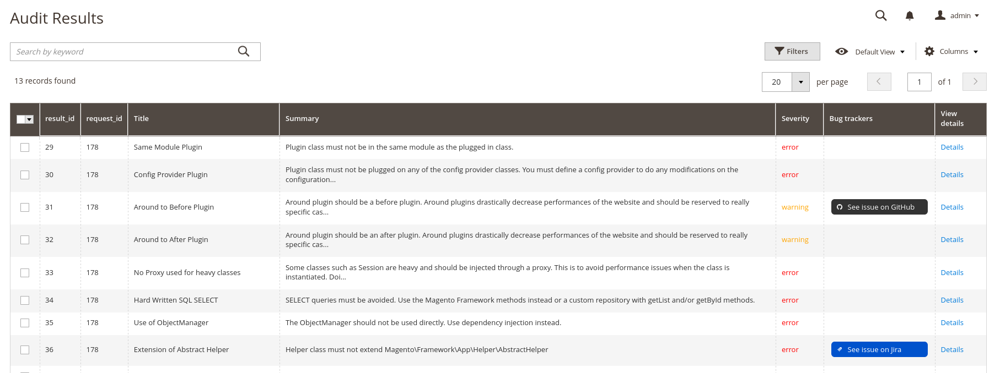

# EasyAudit Premium module

## Description

This module adds some features to the EasyAudit module. First of all, ten new rules are added to the audit. 
An interface is added to the admin grid to display the results of the audit and permits to manage results
directly from it.

## Features

* Generate tickets from the audit results to github and jira
* New rules added to the audit
  * Use of flat catalog
  * Check for heavy tables
  * An advanced block vs view model check
  * PaymentInterface use
  * Use of ObjectManager directly in the code
  * Commands without Proxies
  * Proxies for heavy classes
  * Multiple preferences for the same class
* Generate patches via a private paid API.

## Installation

You can install the module using private packagist. Once your order will be validated, you will receive the credentials to
use the repository. They will be asked during the installation process.

```bash
composer require crealoz/easy-audit-premium
```

## Settings

The settings are available in the admin panel. You can set the API key for the patch generation and tickes generation.




***Note*** : None of the configuration is compulsory. You can use the module without any configuration but related
functionalities will not be available.

## How to use

A new column is added to the admin grid.



You can click on the view link to see the details of the audit. A grid is displayed with the results and you
can see at a glance the different problems and the attributed severity.



### Patch generation
Once you are in the detailed view, there will be a "generate patch" button. This button will open a modal to 
generate the patch. You can choose the path that neeeds to be removed from absolute one and the type of patch.




The patch will be generated and delivered as soon as possible.



The only thing you need to do is to apply the patch to your code. Better do it one by one to avoid any conflict.

#### Available processors

* Around plugins that should be converted to before or after plugins
* Proxies for commands

### Ticket generation

You can generate tickets for GitHub and jira.

Click on any button. A ticket will be generated and the link will be displayed first in the info message and later
in the grid. If an issue has already been created, the button will be deactivated.



The column "bug tracker" has now the link for results where a ticket has been created.




