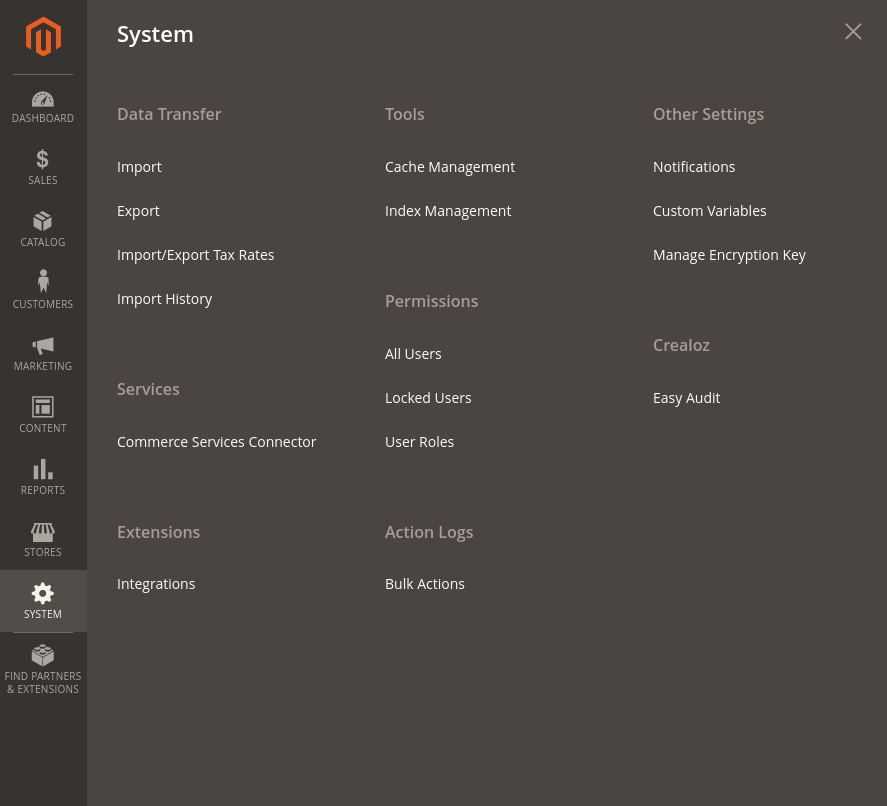
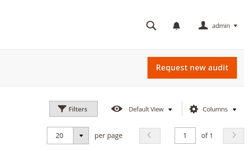
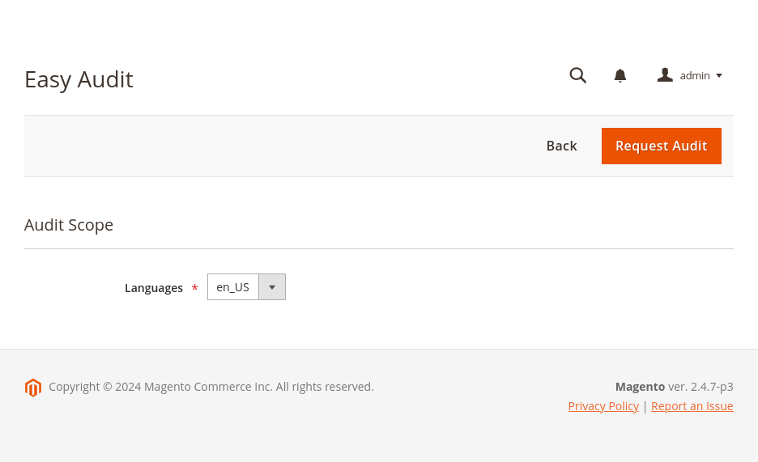
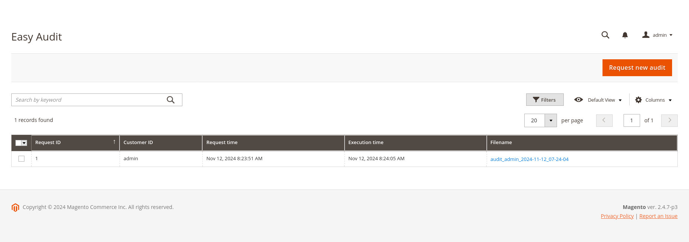

# Request an audit using back-office

EasyAudit allows you to request an audit using the back-office. This is a handy feature that allows you to request an
audit without having to run the command manually.

To request an audit, follow these steps:

1. Log in to the Magento back-office.
2. Navigate to the EasyAudit module.

It can be found in System > EasyAudit that is situated in your Crealoz section.

3. Click on the "Request Audit" button.

It is situated in the top right corner of the page.

4. Fill in the form.

You just need to select a language and click the "Request Audit" button.

4. Wait for the audit to finish.

It usually takes a few minutes to complete. It depends on the size of your Magento application, it's complexity and the
quality of the code. The worse the code is, the longer the audit will take :-).

5. Check the audit results.

Navigate back to the audit page to see the results. You can see the results in the grid and click the filename.

6. Download the audit results and check points that can be improved.

## Get a better insight into the audit results

If things are unclear, you can contact crealoz support to get a better insight into the audit results. We can help you
understand the audit results and provide you with a list of things that can be improved. Fill the form situated at
https://crealoz.fr/un-projet/ (fr) or https://crealoz.fr/get-a-quote/ (en) to get in touch with us.